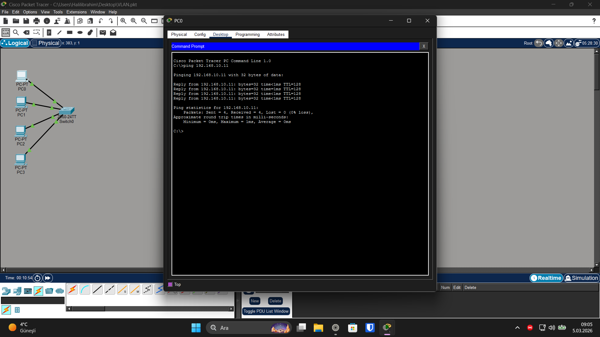

# VLAN Network Lab

🇯🇵 日本語版はこちら → [README_JP.md](README_JP.md)

## Overview

This lab demonstrates basic VLAN configuration on a Layer 2 switch using Cisco Packet Tracer.

Two VLANs are created to segment the network into separate broadcast domains. Devices within the same VLAN can communicate with each other, while devices in different VLANs cannot communicate without a Layer 3 device such as a router.

## Topology

1 Cisco 2960 Switch  
4 PCs  

PC0 and PC1 are assigned to VLAN 10.  
PC2 and PC3 are assigned to VLAN 20.

## Network Design

VLAN 10 – SALES  
Network: 192.168.10.0/24

VLAN 20 – IT  
Network: 192.168.20.0/24

## Devices

- Cisco 2960 Switch
- 4 PCs

## PC Configuration

PC0  
IP Address: 192.168.10.10  
Subnet Mask: 255.255.255.0  

PC1  
IP Address: 192.168.10.11  
Subnet Mask: 255.255.255.0  

PC2  
IP Address: 192.168.20.10  
Subnet Mask: 255.255.255.0  

PC3  
IP Address: 192.168.20.11  
Subnet Mask: 255.255.255.0  

(Default gateway is not required in this lab.)

## Switch VLAN Configuration
enable
configure terminal

vlan 10
name SALES
exit

vlan 20
name IT
exit

interface range fastEthernet0/1-2
switchport mode access
switchport access vlan 10
exit

interface range fastEthernet0/3-4
switchport mode access
switchport access vlan 20
exit

## Verification

Test within the same VLAN:
ping 192.168.20.10
Reply from 192.168.10.11
Test between different VLANs:
ping 192.168.20.10
Request timed out

## Result

Devices within the same VLAN can communicate successfully.

Devices in different VLANs cannot communicate without routing.

This lab demonstrates VLAN-based network segmentation.

## Screenshot

## Lab File

Download the Packet Tracer lab file:

[vlan-network-lab.pkt](vlan-network-lab.pkt)

Tested on Cisco Packet Tracer 8.x

## License

Apache License 2.0
